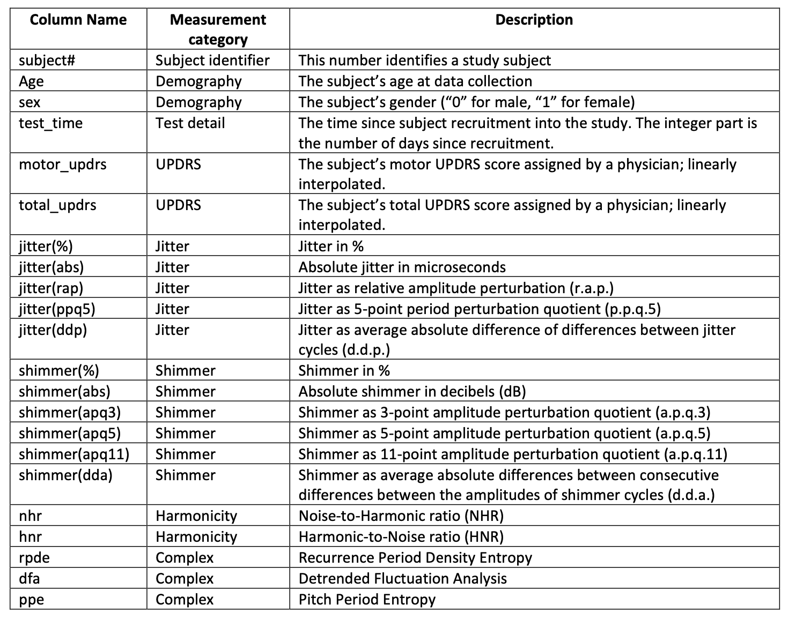
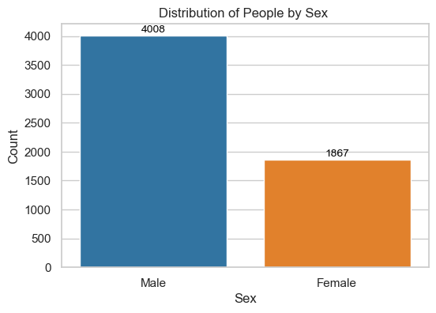
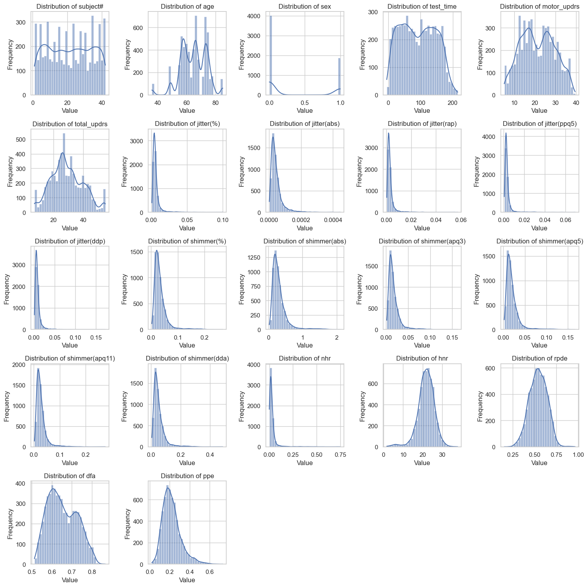
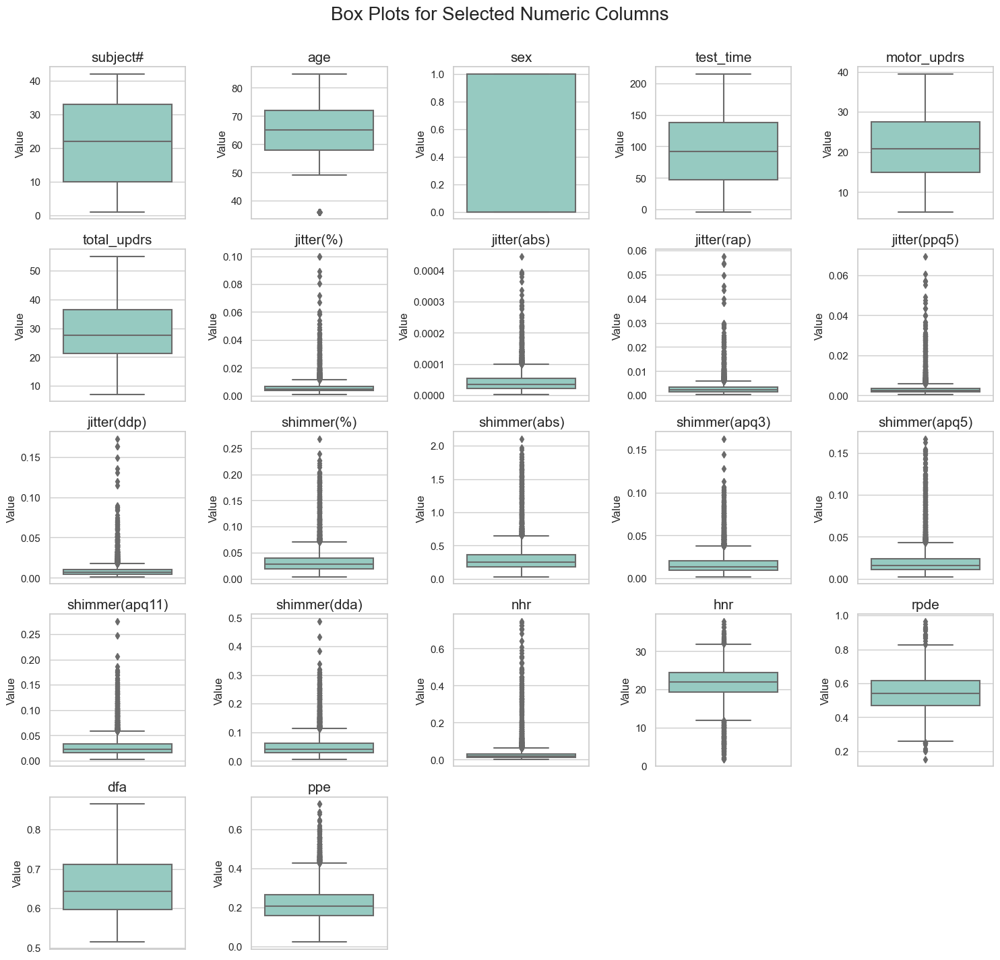
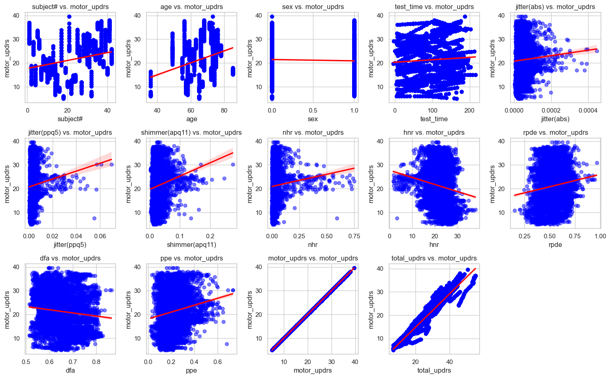
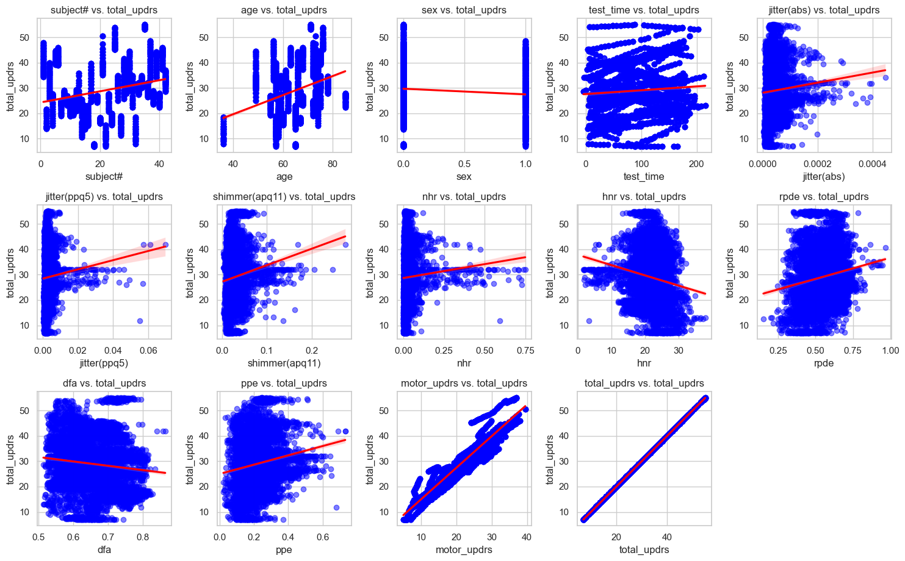
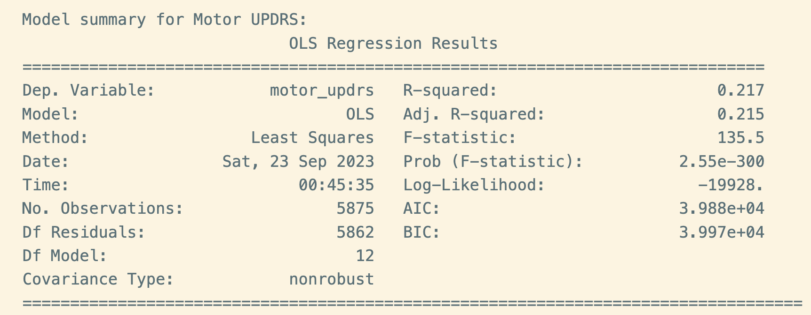
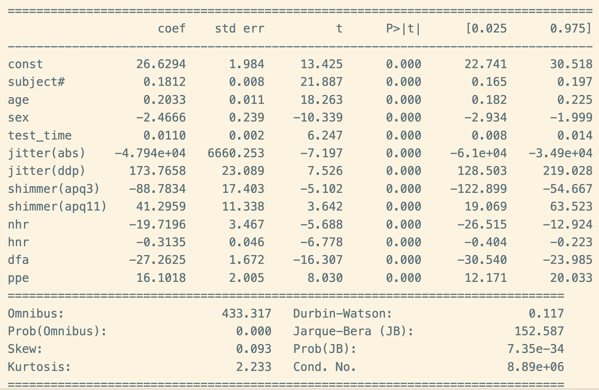

# Project Overview
42 people with early Parkinson's disease (PPD) were used in this experiment to collect voice measures and demographic data for the "po2_data.csv" dataset. The dataset is separate from the first dataset and is only available to PPD participants. A different set of attributes that were taken out of speech samples correlate to each record. Age, gender, test time, and voice-related measures including jitter, shimmer, RPDE, DFA, and PPE are all included in the dataset. A thorough assessment of motor symptoms and total impairment status in people with early-stage Parkinson's disease is provided by the inclusion of Motor UPDRS scores (ranging from 0 to 108) and Total UPDRS scores (ranging from 0 to 176).

The two main goals of this project are to predict the Total UPDRS score for a thorough assessment of overall disability in people with early-stage Parkinson's disease and the Motor UPDRS score for a precise assessment of motor symptoms. For better patient outcomes, these goals seek to improve clinical decision-making, treatment planning, and disease management.

## Key Steps and Insights

The project unfolds through a series of steps. Check the Python code name named Parkinson_Disease_Feature_Selection.py

### 1. Data Loading and Preprocessing

The dataset has a shape of (5875, 22), indicating 5875 instances and 22 features.

#### 1.2 Data Information

The information about the dataset was obtained using the `.info()` method. It confirmed that the dataset contains no missing values, and all columns have either `float64` or `int64` data types.

#### 1.3 Duplicate Rows

Duplicate rows were checked using the `.duplicated()` method. No duplicate rows were found in the dataset.

## 2. Exploratory Data Analysis
Next, we will explore the data. We first checked the proportion of males and females. As shown in the figure below, almost two-thirds of people were male who suffered from Parkinson's Disease.

### 2.1 Measure of Central Tendency
The dataset's central tendency measurements, mean values, median values, and standard deviations provide essential insights into its features. The average age and Motor UPDRS score indicate an even distribution, while larger values indicate more dispersion. Understanding these patterns is crucial for interpreting and modelling.

| Feature          | Mean        | Median (50%) | Standard Deviation |
|------------------|-------------|--------------|--------------------|
| subject#         | 21.494128   | 22.000000    | 12.372279          |
| age              | 64.804936   | 65.000000    | 8.821524           |
| sex              | 0.317787    | 0.000000     | 0.465656           |
| test_time        | 92.863722   | 91.523000    | 53.445602          |
| motor_updrs      | 21.296229   | 20.871000    | 8.129282           |
| total_updrs      | 29.018942   | 27.576000    | 10.700283          |
| jitter(%)        | 0.006154    | 0.004900     | 0.005624           |
| jitter(abs)      | 0.000044    | 0.000035     | 0.000036           |
| jitter(rap)      | 0.002987    | 0.002250     | 0.003124           |
| jitter(ppq5)     | 0.003277    | 0.002490     | 0.003732           |
| jitter(ddp)      | 0.008962    | 0.006750     | 0.009371           |
| shimmer(%)       | 0.034035    | 0.027510     | 0.025835           |
| shimmer(abs)     | 0.310960    | 0.253000     | 0.230254           |
| shimmer(apq3)    | 0.017156    | 0.013700     | 0.013237           |
| shimmer(apq5)    | 0.020144    | 0.015940     | 0.016664           |
| shimmer(apq11)   | 0.027481    | 0.022710     | 0.019986           |
| shimmer(dda)     | 0.051467    | 0.041110     | 0.039711           |
| nhr              | 0.032120    | 0.018448     | 0.059692           |
| hnr              | 21.679495   | 21.920000    | 4.291096           |
| rpde             | 0.541473    | 0.542250     | 0.100986           |
| dfa              | 0.653240    | 0.643600     | 0.070902           |
| ppe              | 0.219589    | 0.205500     | 0.091498           |

### 2.2 Histogram with KDE plots

The histogram plots suggest that most data follow normal distribution with most of them being right skewed like shimmering and jitter columns. 

### 2.3 Confidence Interval

The confidence intervals for various dataset characteristics are shown in the table below. These confidence intervals provide us a range where the genuine population parameter (mean) is most likely to fall. The feature name, its mean value, the lower and upper confidence interval bounds, as well as the table's feature name are all included.

| Feature         | Mean       | CI_Lower   | CI_Upper   |
|-----------------|------------|------------|------------|
| test_time       | 92.86      | 91.50      | 94.23      |
| age             | 64.80      | 64.58      | 65.03      |
| total_updrs     | 29.02      | 28.75      | 29.29      |
| hnr             | 21.68      | 21.57      | 21.79      |
| subject#        | 21.49      | 21.18      | 21.81      |
| motor_updrs     | 21.30      | 21.09      | 21.50      |
| dfa             | 0.65       | 0.65       | 0.66       |
| rpde            | 0.54       | 0.54       | 0.54       |
| sex             | 0.32       | 0.31       | 0.33       |
| shimmer(abs)    | 0.31       | 0.31       | 0.32       |
| ppe             | 0.22       | 0.22       | 0.22       |
| shimmer(dda)    | 0.05       | 0.05       | 0.05       |
| shimmer(%)      | 0.03       | 0.03       | 0.03       |
| nhr             | 0.03       | 0.03       | 0.03       |
| shimmer(apq11) | 0.03       | 0.03       | 0.03       |
| shimmer(apq5)  | 0.02       | 0.02       | 0.02       |
| shimmer(apq3)  | 0.02       | 0.02       | 0.02       |
| jitter(ddp)    | 0.01       | 0.01       | 0.01       |
| jitter(%)      | 0.006      | 0.006      | 0.006      |
| jitter(ppq5)   | 0.003      | 0.003      | 0.003      |
| jitter(rap)    | 0.002      | 0.002      | 0.003      |
| jitter(abs)    | 0.000044   | 0.000043   | 0.000045   |

### 2.4 Box Plotting

In the dataset containing voice measurements and demographic profiles of individuals with early-stage Parkinson's disease, outliers are observed in various numeric features, potentially indicating subject-specific variations and extreme cases within the dataset. These outliers can impact clinical assessments like the Motor and Total UPDRS scores, making their management a crucial step in statistical analysis and predictive modelling to ensure data accuracy and model reliability.

### 2.5 Scatter Plotting

Each subplot in the initial set of scatter plots shows a particular aspect in connection to the "motor_updrs" score (on the y-axis) (on the x-axis). In contrast, the same chosen attributes are analysed in the next set of scatter plots, but this time, they are plotted against the 'total_updrs' score. These scatter plots are useful tools for quickly evaluating potential relationships and trends between the selected characteristics and the clinical evaluation scores. They are essential to the selection of features and to improving our understanding of the underlying properties of the dataset.

## 3. Evaluation of the Multiple Regression Model
In this part, we use the well-known Python machine learning libraries scikit-learn and statsmodels to assess how well our multiple regression models predict both the "Motor UPDRS" and the "Total UPDRS" scores.

To evaluate the model's generalizability to fresh data, we first divide our dataset into training (60%) and test (40%) sets. Using the training data, we create unique linear regression models for each score (Motor UPDRS and Total UPDRS). The test set is then subjected to predictions using these models.

We calculate a number of important indicators to assess the model's performance:

__MAE: Mean Absolute Error__

The average absolute difference between the expected and actual scores is calculated using this metric. Better model accuracy is indicated by a lower MAE.

**MSE: Mean Squared Error**

The average squared difference between predicted values and actual values is calculated. Larger mistakes are penalised more severely by MSE.

**RMSE: Root Mean Squared Error** 

The measure of error in the same units as the target variable is provided by RMSE, which is the square root of MSE.

**R-squared: the coefficient of determination** 

R2 measures the percentage of the target variable's variation that the model accounts for. A number that is nearer 1 denotes a better match.

### 3.1 Using sklearn

## Model Performance
### Motor UPDRS Model:
- **MAE (Mean Absolute Error):** 5.9587
- **MSE (Mean Squared Error):** 50.9515
- **RMSE (Root Mean Squared Error):** 7.1380
- **R-squared (R²):** 0.2165

### Total UPDRS Model:
- **MAE (Mean Absolute Error):** 7.4484
- **MSE (Mean Squared Error):** 83.7815
- **RMSE (Root Mean Squared Error):** 9.1532
- **R-squared (R²):** 0.2496

### Baseline (Dummy) Model for Motor UPDRS:
- **MAE (Mean Absolute Error):** 6.9018
- **MSE (Mean Squared Error):** 65.0378
- **RMSE (Root Mean Squared Error):** 8.0646
- **R-squared (R²):** -5.28e-05

### Baseline (Dummy) Model for Total UPDRS:
- **MAE (Mean Absolute Error):** 8.5392
- **MSE (Mean Squared Error):** 111.6500
- **RMSE (Root Mean Squared Error):** 10.5665
- **R-squared (R²):** -6.29e-08

The above metrics represent the evaluation results of regression models and baseline (dummy) models for predicting Motor UPDRS and Total UPDRS scores. A higher R^2 value indicates a better fit of the model to the data. The performance metrics for the regression models indicate that they provide better predictions for both Motor UPDRS and Total UPDRS scores compared to the simple dummy models that predict mean values. The regression models have lower MAE and RMSE, implying reduced prediction errors. However, there is still room for improvement in explaining variance (R^2), suggesting that further feature engineering or advanced modelling techniques may enhance predictive accuracy.

### 3.1 Using statsmodel
The "Motor UPDRS" and "Total UPDRS" models' R-squared (R2) values show that they account for around 22.86% and 25.81% of the variation in the corresponding target variables, respectively, indicating moderate predictive power. With negative R-squared values, the baseline models for both variables, on the other hand, perform worse than models with no predictive power, suggesting their inefficiency in explaining the variance in the target variables. 

## 4. Optimization of the Model 
### 4.1 Handling Outliers
The Interquartile Range (IQR) approach is used by the code to find outliers in a dataset. Each column's IQR is determined, upper and lower boundaries are established based on a threshold, and any rows that fall outside of these constraints are either removed or replaced by the mean values. Extreme data items that might bias the model's performance and cause overfitting are removed or replaced using this approach. By minimising the impact of outliers on the training process, this data-cleaning technique  may improve the resilience and accuracy of the model. 

We found that, after eliminating outliers from the dataset, the explanatory power of both the "Motor UPDRS" and "Total UPDRS" models somewhat declined. The R2 for the 'Motor UPDRS' model declined from 0.2286 to 0.2127, while the R2 for the 'Total UPDRS' model went from 0.2581 to 0.2386. This implies that either the original data distribution, impacted by the outliers, contributed favourably to model performance, or that outliers may have held important information. The baseline models were still unable to adequately explain the variation of the target variable when outliers were removed.

### 4.2 Rainbow Tests for Linearity 
The scatter plots didn't provide us with a lot of information on linearity. Therefore, using two different linear regression models—one for "motor_updrs" and the other for "total_updrs"—we conducted Rainbow Tests for linearity. The Rainbow Test determines if there is a linear relationship between the independent factors and the dependent variables. The results of both tests show that the linearity p-values are very small, close to 0.0, which is much less than the usual cutoff of 0.1. As a result, both tests "Fail" to satisfy the linearity assumption, suggesting that the connections may not be linear. These results imply that the complicated relationships between the variables may not be well captured by linear regression models, necessitating the use of alternative modelling strategies or more research.

### 4.3 Yeo-Johnson Power Transformation
In order to attain linearity in linear regression, the Yeo-Johnson Power Transformation approach employs non-linear transformations. Outliers, non-linear correlations, skewed data distributions, and non-constant variance are all addressed. The technique seeks to increase data symmetry, stabilise variance, capture non-linear patterns, and lessen the effect of extreme values. This improves the model's capacity to precisely capture explanatory and response variables by aligning the data with the assumptions of linearity, constant variance, and normality.

The Motor UPDRS model's R-squared value increased thanks to the Yeo-Johnson transformation from 0.2286 to 0.2341, indicating a more effective explanation of variance than the original model. The Total UPDRS model, on the other hand, showed a little decline from 0.2581 to 0.2562, which indicated no gain in performance. Small variations in R-squared values might happen, thus these modifications should be understood in the context of the particular dataset and the type of processing.

